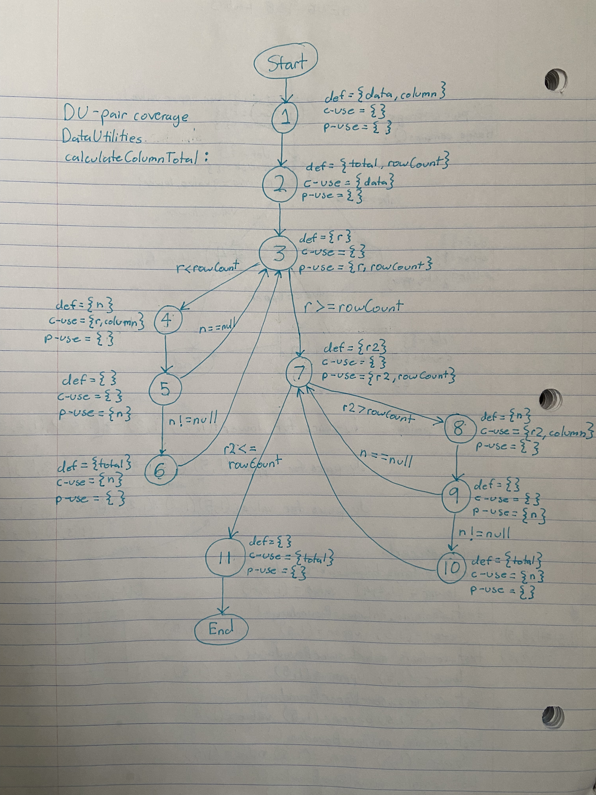
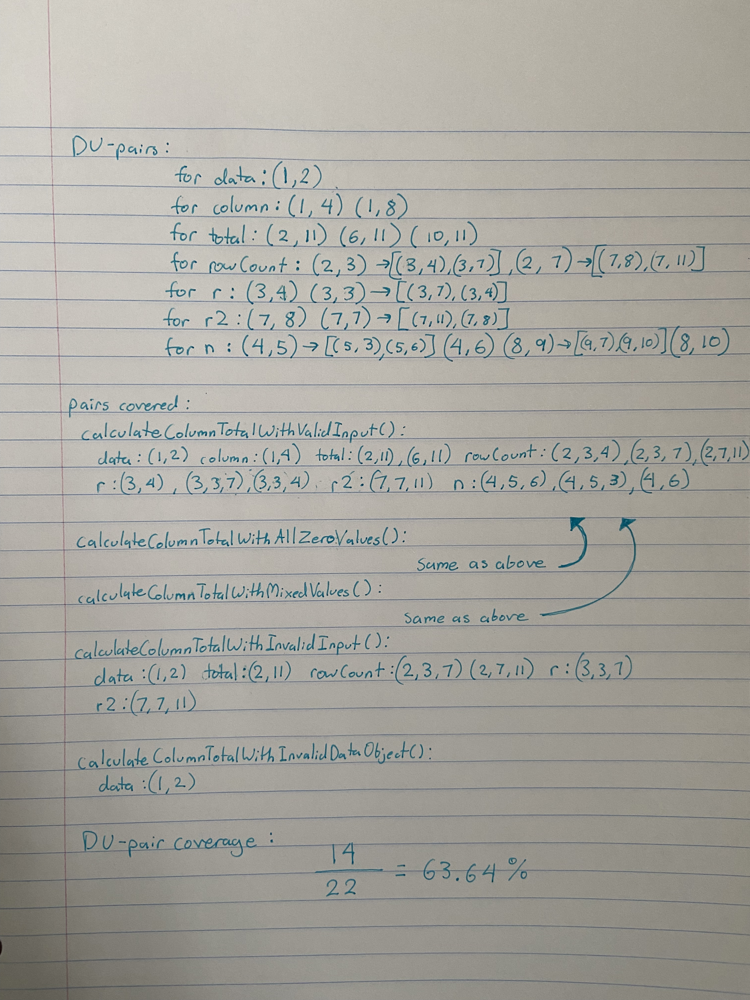
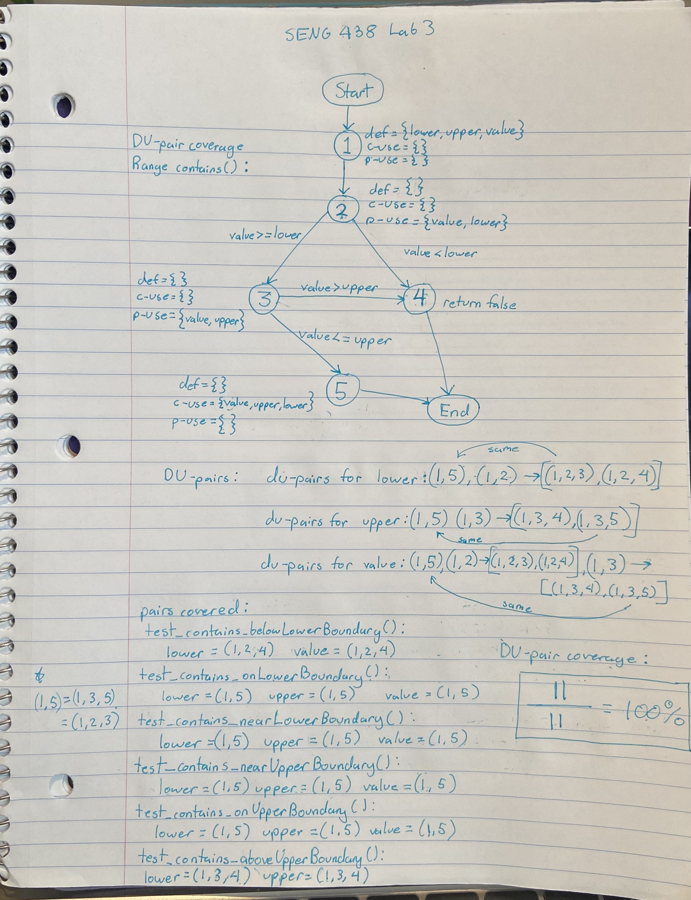

**SENG 438 - Software Testing, Reliability, and Quality**

**Lab. Report #3 – Code Coverage, Adequacy Criteria and Test Case Correlation**

| Group \#:      |  1   |
| -------------- | --- |
| Student Names: |   Harris Hasnain   |
|                |   Houssem Zaggar  |
|                |   Spencer van Roessel  |
|                |   Kaylyn Tanton |

(Note that some labs require individual reports while others require one report
for each group. Please see each lab document for details.)

# 1 Introduction

This lab served as an introduction to white-box testing design and implementation. We utilized coverage metrics to analyze the effectiveness of our test suite from the previous assignment, then designed new white-box test cases using control-flow coverage metrics such as statement and branch coverage and measued the improvement relative to our original code, and measured the data-flow coverage of specific methods. This lab provided experience developing and analyzing white-box tests and demonstrated the benefits and drawbacks of coverage-based testing relative to requirement-based testing.

# 2 Manual data-flow coverage calculations for X and Y methods

# 3 A detailed description of the testing strategy for the new unit test

Note: Method coverage was used instead of condition coverage, because none of the coverage tools provided to us appeared to have condition coverage as a metric according to their documentation

The strategy to develop new test cases for the suite to improve the coverage metrics will be implemented as follows: focus on method coverage first for all methods, to ensure all methods are in the test suite. This can be implemented by making sure each method has at least one associated test in the suite. Then write tests to maximize statement coverage to cover all of the lines in each method. The coverage tool should highlight uncovered lines in the DataUtilities and Range classes, so new tests should be added to reach lines that have not been covered by the existing tests. Finally, the tests for branch coverage should be implemented for paths that are not reached by the tests developed so far. This can be done by viewing each class and checking all of the decision paths, then comparing them using the tool to the current test suite to check which path outcomes are covered, and write tests for the paths that are not covered. This should maximize all 3 coverage metrics if new tests are implemented in this manner.

# 4 A high level description of five selected test cases you have designed using coverage information, and how they have increased code coverage

Note: all test methods that increased coverage can be found in the JFreeChart_Lab3/src/org/jfree/data/test/DataUtilitiesTest.java file in the repository

1. calculateColumnTotalWithNullValues
This function increased branch coverage by testing the path in the calculateColumnTotal function that executes only when one of the input values is null

2. calculateRowTotalWithNullInput
This function increased branch coverage by testing the path in the calculateRowTotal function that executes only when one of the input values is null

3. testEqualAIsNull
This function increased branch coverage by testing the path in the equal function that executes only when the first input array is null

4. testEqualBIsNull
This function increased branch coverage by testing the path in the equal function that executes only when the second input array is null

5. testCloneNullRow
This function increased branch coverage by testing the path in the clone function that executes only when one of the input array rows is null

# 5 A detailed report of the coverage achieved of each class and method (a screen shot from the code cover results in green and red color would suffice)

### Data Utilities
Note: The actual coverage output screenshots from eclipse are in the “DataUtilities Coverage Screenshots” folder in the repository, these are the results in tabular form.

IMPORTANT Coverage Notes:
1. Method coverage was used instead of condition coverage for DataUtilities and Range, because none of the coverage tools provided to us appeared to have condition coverage as a metric according to their documentation
2. Statement coverage for the DataUtilities class was 88.4% instead of 90% as required in the handout. This is because multiple methods in the class had infeasible paths (some screenshots of these infeasible paths are in the “DataUtilities Coverage Screenshots” folder) and therefore, the code within these paths could not be executed. Statement coverage was maximized in every feasible path though, leading to a total statement coverage just shy of 90%, and the branch coverage was above 70% as requested.

### Range

# 6 Pros and Cons of coverage tools used and Metrics you report

Pros and cons of Tool Choices: Initially, both coverage tools had issues with handling mocking. However, once I added the dependency .jar files from the assignment 2 folder to my assignment 3 workspace, the coverage tools were able to run tasks with mocking successfully. This was the only change I needed to make to get mocking to work. The EclEmma tool and Clover tool both gave similar metrics, with Clover generally reporting higher coverage values for metrics that both tools had. Whether this is because Emma is undercalculating or Clover is overcalculating is unknown. Both tools were very simple to integrate and use in the IDE, only requiring a few simple installation steps. The metric display for both is highly similar, but I found that I preferred Emma due to the layout being easier to read and only reporting one percentage for each coverage metric line by line, as opposed to all on the same line for clover, with covered and uncovered for each metric.

Branch Coverage Pros and cons: Branch coverage evaluates how many decision paths are tested in the program, which is important if a certain path or branch of the code leads to an error. However, it may not take into account factors such as invalid values in the decision path that could lead to an error, if the path successfully runs for valid values, an example being the divide by zero error.
Statement  Coverage Pros and cons: Statement coverage ensures that lines of code are not missed when testing, which can be vital if the missed line contains an error. A downside to statement coverage is that it does not check all of the paths a program can take, which can lead to problems if one path it has not checked leads to an error in the program
Method Coverage Pros and cons: Method coverage ensures that all methods in the program are tested. However, it is a rather poor performance metric as it does not take into account how much of the method (lines, branches, etc) are tested.

# 7 Section 3.1 results (coverage metrics of old test suite).

For the DataUtilities Class, the coverage metrics chosen were Branch, Statement, and Method, since condition was not an available metric in either of the tools used (EclEmma and Clover). The reported metrics are displayed below:

Branch coverage: 29.4% (EclEmma)
30.6% (Clover)

Statement coverage: 46.3% (Clover)
(EclEmma did not have statement coverage)

Method coverage: 50.0% (EclEmma)
55.6% (Clover)

# 8 A comparison on the advantages and disadvantages of requirements-based test generation and coverage-based test generation.

The difference between requirements-based and coverage-based is that in requirements, test cases are designed based on objectives / requirements of the class / methods, whereas coverage is based on analyzing the source code of the methods themselves to ensure certain criteria such as statement and branch coverage are satisfied. A benefit of requirements-based is that tests are primarily based on ensuring the method provides the expected user functionality without errors, meaning it is a good way to ensure the program meets the user requirements successfully. It can also be shorter / simpler to write test cases as you do not need to know the internal details of the methods you are testing, only what they do. However, a drawback of requirements-based is that because you do not access the internal details of the methods, there can be statements or branches / paths in the method that are not covered or missed in the test cases, which can lead to program failure if the missed paths contain errors, and the user ends up executing one of these paths. This is where coverage-based testing excels. Instead of being based on external requirements, it tracks certain metrics in the source code of the method itself, such as statement (number of lines executed) and branch (number of paths executed) coverage. A benefit of coverage-based is that it fixes the problem from requirements-based, when the coverage metrics are maximized it ensures that little to no lines of code / execution paths are unaccounted for and function as intended, reducing the chance of missing an error that could be fatal to the program. A drawback of coverage-based testing is that it is focused primarily on ensuring the quality of the source code, rather than meeting user expectations, which can be a problem even if the code runs successfully, because it still may not deliver the exact specifications required by the user. Another drawback is that coverage-based tests can take significantly longer to implement that requirements-based, due to it being a far more extensive and comprehensive testing method.

# 9 A discussion on how the team work/effort was divided and managed

We divided the work amongst our team in an identical way to the previous lab. We split based on java classes as opposed to instruction steps, with one pair implementing the previous test analysis, data-flow coverage and new test case design for DataUtilities, and another for range class, along with the associated components in the lab report. This ensured that the work / effort division was equal, and that all group members got to go through the full analysis, design and implementation procedure of the lab.

# 10 Any difficulties encountered, challenges overcome, and lessons learned from performing the lab

The white-box test design, development and running process was very straightforward due to the concepts being explained in lectures and previous experience using JUnit tests, there were times when it was difficult to determine how many different tests were needed to execute all of the statements or branch paths in a method, but the coverage tools, mainly Clover, provided very useful statement and branch coverage information that made determining missing coverage very straightforward. Something that proved to be a challenge was dealing with methods that had infeasible paths (methods with certain lines that could not be reached under normal circumstances), while still trying to maximize coverage for the valid components of the method. Although the number of methods we had to test were few, designing tests to ensure the highest possible statement and branch coverages for each method required a fair amount of unit test design and implementation to cover them effectively. From this challenge, a lesson we learned was the importance of white-box testing methods in making sure that essential components of the methods being tested, such as statements and branches were not being skipped over, which could lead to user errors in the future for missed paths / statements that do not function as intended.

# 11 Comments/feedback on the lab itself

Overall, the content of this lab was very informative in demonstrating the importance of white-box design and development for the purposes of extensive software testing, to make sure that all program outcomes work as expected to provide the ideal experience to the user. It was helpful in teaching us how to implement an effective white-box testing process through plan, design, implementation and execution using JUnit. As with the last lab, we believe that the contents and structure of this lab handout had a much more efficient layout and explanation, making it easier for us to fully understand our tasks in this lab relative to the first one.

